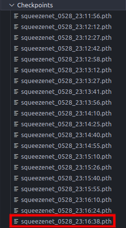
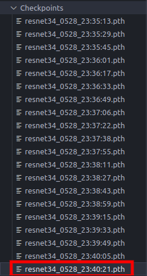
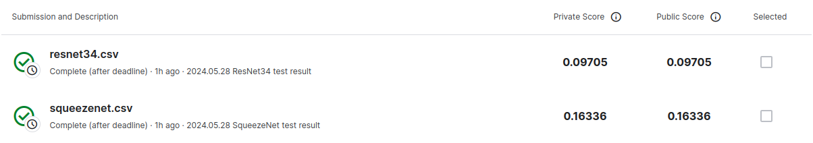

# 【Kaggle竞赛实战】猫狗识别器
本仓库代码主要使用预训练的ResNet34网络和预训练的SqueezeNet网络完成kaggle经典猫狗分类竞赛的任务，可以视作CV领域入门的第二个训练项目。

本项目除了巩固使用神经网络完成图像分类的方法之外，更重要的在于提供一种比较清晰而明确的代码结构框架，后序代码均可依据该框架进行编写，比较条理且美观。

代码结构如下：
- **Data**（保存项目数据）
    - test  （测试数据，用于创建测试集）
    - train （训练数据，划分后用来创建训练集和验证集）
- **Dataset**（保存构建数据集和数据加载器的文件）
    - \_\_init\_\_.py（该文件的作用在于将该文件夹转为包，从而实现模块的便利调用，以下同理不再赘述）
    - dataset.py （内含数据集[Dataset]划分和构建操作以及数据加载器[DataLoader]构建操作）
- **Models**（保存模型定义文件）
    - \_\_init\_\_.py 
    - BasicModel.py （基本模型，作为以下具体神经网络实现的基类，主要实现了load和save功能）
    - resnet34.py （读取了预训练ResNet34神经网络的结构参数并根据需求调整输出）
    - squeezenet.py （读取了预训练SqueezeNet神经网络的结构参数并根据需求调整输出）
- **Checkpoints** （保存了训练完毕的模型数据）
    - resnet34_final.pth
    - squeezenet_final.pth
- **Utils**（保存项目中使用到的工具函数）
    - \_\_init\_\_.py
    - visualizer.py（实现了在visdom的可视化操作，但是如果没有可视化界面的话没法实现，因为本人使用远程服务器端的GPU进行训练，因此在本项目中visdom相关代码被注释掉）
- **config.py** (配置文件，保存了项目中使用到的相关参数，可以在文件中直接修改参数)
- **main.py** (主函数，包含训练函数、验证函数、测试函数以及一些功能函数)
- **README.md** (项目文档说明)

本人已在各部分代码中添加了尽可能详细的注释，可自行按照以上的文件结构顺序进行学习参考。

---

在main函数中涉及到fire工具包的相关使用，fire工具包的作用在于能够直接调用main函数中的函数体，同时可以在命令行直接向函数中传递相应参数，完成对项目中相关配置参数（在config中）的修改。

以下对两种神经网络的训练和测试过程分别举例说明：

（1）SqueezeNet网络

训练时的相关参数设置如下：

```python
env = 'default'         # visdom环境
vis_port = 8097         # visdom端口
model = 'SqueezeNet'    #使用的模型，名字必须与名字必须与models/__init__.py中的名字一致

train_data_root = '/data/jyc/cats_vs_dogs/train/'     #训练集存放路径
test_data_root = '/data/jyc/cats_vs_dogs/test/'       #测试集存放路径
load_model_path = None                  #加载与训练模型的路径，为None表示不加载

batch_size = 128         #batch size
use_gpu = True          #是否使用GPU
num_workers = 8         #加载数据时使用多少个工作单位
print_freq = 4         #每N个batch打印一次信息

debug_file = 'tmp/debug'        ## if os.path.exists(debug_file): enter ipdb
result_file = 'result_SqueezeNet.csv'      #存放最终结果的文件

max_epoch = 20          #训练轮数
lr = 0.008                #初始化学习率
lr_decay = 0.95         #学习率衰减，lr = lr * lr_decay，随着训练的进行逐渐减小学习率的大小，使得模型在训练后期更容易收敛到全局最优解而不是在最优解附近振荡
weight_decay = 1e-4     #权重衰减，一种正则化技术，通过向损失函数添加一个惩罚项来减小模型的权重值，以防止过拟合，提高模型的泛化能力
```

训练代码为：
```python
python main.py train
```

在训练过程中，Checkpoints在每个batch训练完后都会保存一遍模型，防止训练过程中发生异常中断导致需要从头训练，训练完所有的epoch后Checkpoints中含有的所有模型如下：

<center>



</center>

其中，本仓库Checkpoints中的squeezenet_final.pth文件就是对上图红色框内的文件修改得到的，因为该模型文件是最后一个batch训练完后生成的，也就意味着这个文件是最终训练出来的模型文件。

测试的代码为：
```python
python main.py test --load_model_path="./Checkpoints/squeezenet_final.pth"
```
test后面紧跟的--XXX部分代码就是输入**kwargs字典部分的数据，如此输入可以直接修改config中的配置，以实现在测试时调用训练好的模型。

完成训练后可以得到result_SqueezeNet.csv文件，将该文件上传到kaggle平台即可获取评分。


(2)ResNet34网络

该网络的训练与上述基本相同，只是需要修改一下config中的相关参数。
```python
env = 'default'         # visdom环境
vis_port = 8097         # visdom端口
model = 'ResNet34'    #使用的模型，名字必须与名字必须与models/__init__.py中的名字一致

train_data_root = '/data/jyc/cats_vs_dogs/train/'     #训练集存放路径
test_data_root = '/data/jyc/cats_vs_dogs/test/'       #测试集存放路径
load_model_path = None                  #加载与训练模型的路径，为None表示不加载

batch_size = 128         #batch size
use_gpu = True          #是否使用GPU
num_workers = 8         #加载数据时使用多少个工作单位
print_freq = 4         #每N个batch打印一次信息

debug_file = 'tmp/debug'        ## if os.path.exists(debug_file): enter ipdb
result_file = 'result_ResNet34.csv'      #存放最终结果的文件

max_epoch = 20          #训练轮数
lr = 0.01                #初始化学习率
lr_decay = 0.95         #学习率衰减，lr = lr * lr_decay，随着训练的进行逐渐减小学习率的大小，使得模型在训练后期更容易收敛到全局最优解而不是在最优解附近振荡
weight_decay = 1e-4     #权重衰减，一种正则化技术，通过向损失函数添加一个惩罚项来减小模型的权重值，以防止过拟合，提高模型的泛化能力
```
训练代码为：
```python
python main.py train
```

在训练过程中，Checkpoints在每个batch训练完后都会保存一遍模型，防止训练过程中发生异常中断导致需要从头训练，训练完所有的epoch后Checkpoints中含有的所有模型如下：

<center>



</center>

其中，本仓库Checkpoints中的resnet34_final.pth文件就是对上图红色框内的文件修改得到的，因为该模型文件是最后一个batch训练完后生成的，也就意味着这个文件是最终训练出来的模型文件。

测试的代码为：
```python
python main.py test --load_model_path="./Checkpoints/resnet34_final.pth"
```
test后面紧跟的--XXX部分代码就是输入**kwargs字典部分的数据，如此输入可以直接修改config中的配置，以实现在测试时调用训练好的模型。

完成训练后可以得到result_ResNet34.csv文件，将该文件上传到kaggle平台即可获取评分。

---

最终提交到kaggle平台的两个csv文件的评分如下：

<center>



</center>

其中最终分数越低表示预测越准确。可以看到resnet34网络的效果是好于ResNet网络的。

---

至此全部项目结束，该项目的主要目的在于学习文件结构，便于之后代码的美观实现。

END！